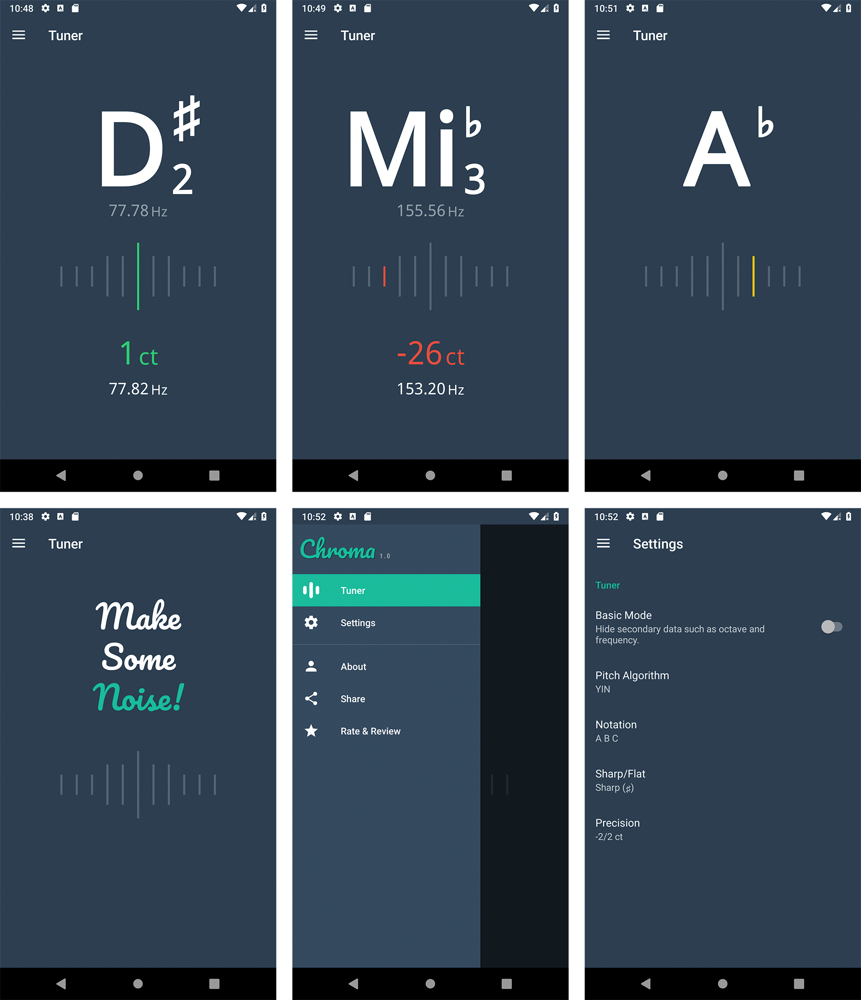

# Chroma

Chroma is a [chromatic tuner](https://en.wikipedia.org/wiki/Chromatic_scale), the perfect app to help you tune your musical instruments with precision and elegance.

Features:
* Basic and complete UI modes
* Noise suppressor
* Letter (A B C) and Solfege (Do Re Mi) notations
* Sharp (♯) and Flat (♭) semitones
* Tuning precision (from 0 to -5/+5 cents)
* Many available pitch detection algorithms (powered by [TarsosDSP](https://github.com/JorenSix/TarsosDSP/)):
    * [YIN](http://audition.ens.fr/adc/pdf/2002_JASA_YIN.pdf)
    * [FFT YIN (Fast Fourier Transform)](https://en.wikipedia.org/wiki/Fast_Fourier_transform)
    * [MPM (McLeod Pitch Method)](http://miracle.otago.ac.nz/tartini/papers/A_Smarter_Way_to_Find_Pitch.pdf)
    * [AMDF (Average Magnitude Difference Function)](https://ieeexplore.ieee.org/abstract/document/1162598)
    * [DYWA (Dynamic Wavelet)](https://pdfs.semanticscholar.org/1ecf/ae4b3618f92b4267912afbc59e3a3ea1d846.pdf)

## Screenshots

